# Encode Solidity Bootcamp - Team 9 - Week#4

## Instructions

- Form groups of 3 to 5 students
- Complete the projects together
- Create a voting dApp to cast votes, delegate and query results on chain
- Request voting tokens to be minted using the API
- (bonus) Store a list of recent votes in the backend and display that on frontend

## Basic information

Dapp url: https://team9-voting.herokuapp.com/

Ballot contract address: `0x6f595828988AEe4eE6F34B546b47942c075518da`

Token contract address: `0x906564C66A86A0193ed17efa1C7EbcC022A3fDAB`

## Solution description

### Components

Our solution is composed of following components:

- Frontend application

Application is written in Angular and is responsible for interacting with the end users. It implements the voting worklow, integration with Metamask wallet and communication with the backend REST services.

- Backend application

It is written in NestJS framework and is responsible for bootstraping the frontend application, integrating with blockchain and implementing caching for better user experience.

- Web wallet (Metamask)

A crypto wallet which serves as a secure gateway for users to interact with the blockchain. Our frontend application initiates the transactions and wallet provides an interface for users to commit them to the blockchain.

- Ballot smart contract

Smart contract deployed to the blockchain which implements tokenized voting system.

- Token smart contract

Smart contract deployed to the blockchain which implements secure and fair token distribution and delegation.

- Interaction script

Utility script which implements commonly used functions - deploying the contracts, setting roles and others.

### Application description

Application consists of multiple sections. It is structured in a way to guide a user through the process of casting a vote.

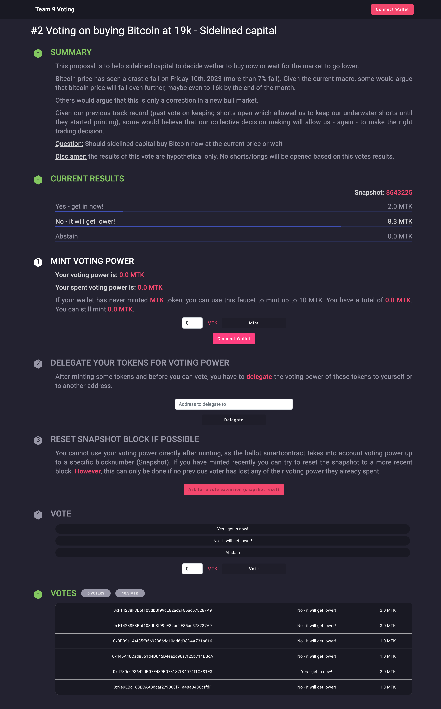

**Summary**

This section describes what is the ballot about. It provides context and states a question which is subject of the ballot.

**Current results**

Show current sate of the ballot - snapshot block number and list of proposals with vote counts and graphical representation of the percentages.

**Mint voting power**

Here we show user information - what his voting power is and how much tokens can he mint. He can trigger the process of minting additional tokens.

**Delegating tokens**

User must delegate tokens to gain voting power. By default, delegation address is set to his own address, but can be changed if user wants to.

**Reseting snapshot**

If user delegates after the snapshot was already taken, he can request to reset the snapshot to current latest block number. This would allow him to recieve voting power and be able to vote. This action can fail, if new state can't retain current voting results.

**Vote**

Proposals are shown here and users can select one and vote for it with all or some amount of their voting power.

**List of votes**

This is a history of all the votes for this ballot.

### Technical description

The interactions between different components of the solution are described in the following diagram.

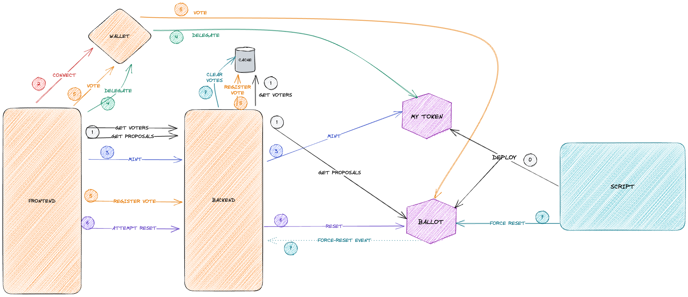

**0 - Contract deployment**

Deployment is implemented in the script which allows user to deploy token or ballot contract. It asks user for parameters that are needed for the deployment and executes it.

```bash
npm run deploy

> voting-contracts@1.0.0 deploy
> ts-node --files ./scripts/Deployment.ts

Wallet address: 0x94699Cc8525BA26463F735efb6E16609b8A6a2C9
Balance: 407770031874859383
Do you want to deploy Token [1] or Ballot Contract [2] or exit [3]: 2
Token address: 0x906564C66A86A0193ed17efa1C7EbcC022A3fDAB
Proposals, separated with `,`: Yes - get in now!,No - it will get lower!,Abstain
Voting snapshot block number: 8642477
Parsed proposals: ["Yes - get in now!","No - it will get lower!","Abstain"]
Deploying Ballot contract
Ballot contract address: 0x6f595828988AEe4eE6F34B546b47942c075518da
```

**1 - Basic Ballot info**

To present the needed Ballot information, frontends calls following endpoints.

Ballot info interacts with `Ballot` contract and returns its address and current snapshot block number.

```json
GET /ballot/info

<<<
{
    "address": "0x6f595828988AEe4eE6F34B546b47942c075518da",
    "snapshotBlockNumber": 8643355
}
```

Proposals info interacts with `Ballot` contract and returns all the proposals. Backend calculates the voting percentages and sets the winner.

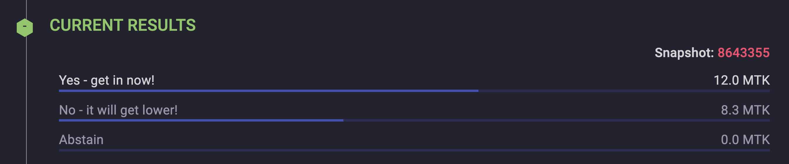

```json
GET /ballot/proposals

<<<
[
    {
        "id": 0,
        "name": "Yes - get in now!",
        "voteCount": "12000000000000000000",
        "winner": true,
        "percentage": 59
    },
    {
        "id": 1,
        "name": "No - it will get lower!",
        "voteCount": "8300000000000000000",
        "winner": false,
        "percentage": 40
    },
    {
        "id": 2,
        "name": "Abstain",
        "voteCount": "0",
        "winner": false,
        "percentage": 0
    }
]
```

On backend application startup all the current votes are retrieved from the `Ballot` contract. They are saved in the static variable which acts like a cache. All the requests to this endpoint are served from the cache. When user casts a vote, frontend application calls `/ballot/register-vote` to add his vote to the cache.

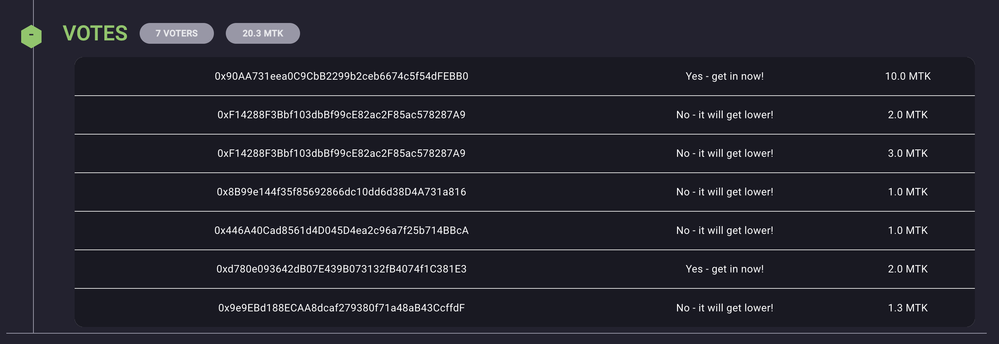

```json
GET /ballot/voters

<<<
[
    {
        "address": "0x90AA731eea0C9CbB2299b2ceb6674c5f54dFEBB0",
        "votingPowerSpent": "10000000000000000000",
        "proposal": "Yes - get in now!"
    },
    {
        "address": "0xF14288F3Bbf103dbBf99cE82ac2F85ac578287A9",
        "votingPowerSpent": "2000000000000000000",
        "proposal": "No - it will get lower!"
    }
]
```

**2 - Connecting the wallet**
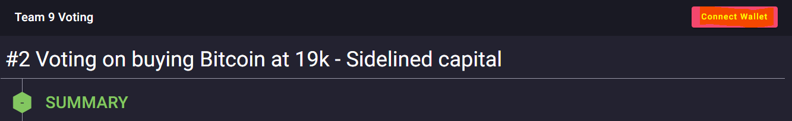

When the user clicks on "Connect Wallet" he will prompted to connect his wallet via "Metamask" and then if he is not on the `goerli` network, he will be promped to change network.

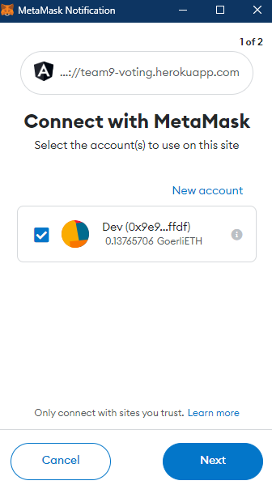 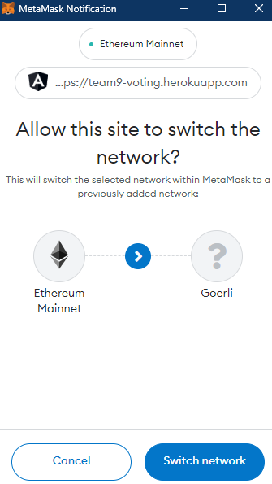

This is achieved on the front end via the `connect` and `switchNetworkToGoerli` methods in `src/services/web3.service.ts`.

**3 - Minting tokens**

Token contract was modified to include a limitation of maximum number of tokens that can be minted.

```javascript
uint256 public constant MAX_MINT_AMOUNT = 10 ether;

function mint(address to, uint256 amount) public onlyRol (MINTER_ROLE) {
        require(minters[to] + amount <= MAX_MINT_AMOUNT, string.concat("You cannot mint more than ", Strings.toString(MAX_MINT_AMOUNT / 1 ether), " MTK"));
        _mint(to, amount);
        minters[to] += amount;
    }
```

The minting is done through the backend, which holds a private key of a wallet that has MINTER_ROLE assigned to it. Frontend sends connected users address and amount of tokens to mint (in `wei`).

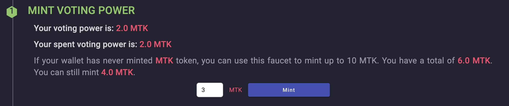

```json
POST /token/mint
>>>
{
"address": "0xd780e093642dB07E439B073132fB4074f1C381E3",
"amount": "1000000000000000000"
}

<<<
{
    "tx": "0xf9889a35331b153f865c3b11a5925fb87570cab149552e4fa1d5c25bc7654bf3",
    "amount": "1000000000000000000"
}
```

**4 - Delegating**

The delegating process is done through the front-end as it is the user who has to make this transaction. His wallet is used to sign and broadcast the transaction.

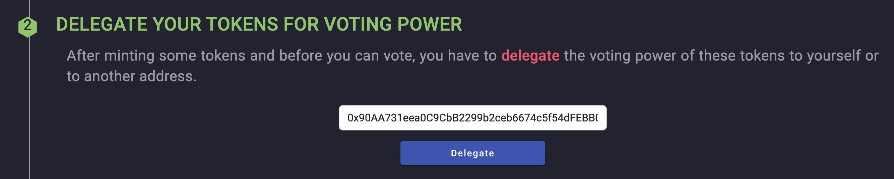

```
  public async delegate(address: string): Promise<void> {
    // get address
    await this.getTokenAddress();
    // get contract
    const contract = new ethers.Contract(
      this.address,
      mytoken.abi,
      this.web3.provider
    );

    const tx: ContractTransaction = await contract
      .connect(this.web3.provider!.getSigner())
      ['delegate'](address);

    const receipt: ContractReceipt = await tx.wait();
  }

```


**5 - Voting**

The voting is handled by the front-end as well for the same reasons as the delegating. 

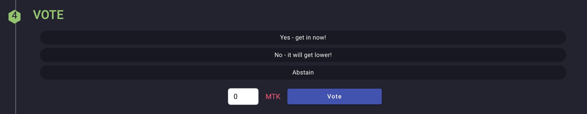

```
  public async vote(amount: number, proposalId: number) {
    if (!this.address) {
      await this.getInfos();
    }
    const address = this.address!;

    // get contract
    const contract = new ethers.Contract(
      address,
      ballot.abi,
      this.web3.provider
    );

    const amountBN = ethers.utils.parseEther(amount.toString()).toString();
    const tx: ContractTransaction = await contract
      .connect(this.web3.provider!.getSigner())
      ['vote'](proposalId, amountBN);

    const receipt: ContractReceipt = await tx.wait();

    // inform back-end
    const registerData: VoteDto = {
      address: this.web3.address!,
      proposalId: proposalId,
      votingPower: ethers.utils.parseEther(amount.toString()).toString(),
    };
    await this.api.post<any>('ballot/register-vote', registerData);
  }

```

**6 - Attempt reset**

When user attemts to reset, the request is sent to the backend which retirieves latest block number and calls reset on the `Ballot` contract. The `Ballot` contract will check if reset is possible and if it is, it will set new snapshot block number.

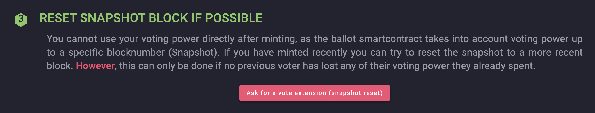

```json
POST /ballot/reset

<<<
{
    "address": "0x6f595828988AEe4eE6F34B546b47942c075518da",
    "snapshotBlockNumber": 8643355
}
```

If reset is succesful, user gains the voting power and can cast his vote.

**7 - Force reset**

Force reset is an operation that can not be performed through frontend, just with a script. This method was added to `Ballot`, to be able to clear the current votes and restart the voting.

```javascript
    function forceReset(
        uint256 newBlockNumber
    ) external onlyRole(DEFAULT_ADMIN_ROLE) {
        for (uint i = 0; i < voters.length; ++i) {
            votingPowerSpent[voters[i]] = 0;
            hasVoted[voters[i]] = false;
        }

        for (uint i = 0; i < proposals.length; ++i) {
            proposals[i].voteCount = 0;
        }

        delete voters;
        delete votes;

        targetBlockNumber = newBlockNumber;

        emit ForceResetEvent();
    }
```

The function emits `ForceResetEvent` event. Backend appliation listenes for this event, and clears the voters cache when it consumes it. In this way we achieved that frontend application shows correct state of the votes in the ballot.

## Interactions #1 - Ewan Debove

| Transaction type | Delegate                                                                                                                                                                |
| ---------------- | ----------------------------------------------------------------------------------------------------------------------------------------------------------------------- |
| Transaction Hash | [0x277c77ce373a4e1484336f6088c51f75429719b459dbb998a0e4b2bbb674fa48](https://goerli.etherscan.io/tx/0x277c77ce373a4e1484336f6088c51f75429719b459dbb998a0e4b2bbb674fa48) |
| Status           | **✅ Success ✅**                                                                                                                                                       |
| Block            | [8643022](https://goerli.etherscan.io/block/8643022)                                                                                                                    |
| From             | [0x446A40Cad8561d4D045D4ea2c96a7f25b714BBcA](https://goerli.etherscan.io/address/0x446A40Cad8561d4D045D4ea2c96a7f25b714BBcA)                                            |
| To               | [0x906564C66A86A0193ed17efa1C7EbcC022A3fDAB](https://goerli.etherscan.io/address/0x906564C66A86A0193ed17efa1C7EbcC022A3fDAB)                                            |
| Transaction Fee  | 0.000000037992216792 ETH                                                                                                                                                |
| Gas              | 96535 / 96711 (99%)                                                                                                                                                     |
| decoded input    | -                                                                                                                                                                       |
| decoded output   | -                                                                                                                                                                       |

| Transaction type | Delegate                                                                                                                                                                |
| ---------------- | ----------------------------------------------------------------------------------------------------------------------------------------------------------------------- |
| Transaction Hash | [0x2ec502c4908581819fc59ef9c60c6fdd8b470aa47b88362c456c923df7d6ff78](https://goerli.etherscan.io/tx/0x2ec502c4908581819fc59ef9c60c6fdd8b470aa47b88362c456c923df7d6ff78) |
| Status           | **✅ Success ✅**                                                                                                                                                       |
| Block            | [8643034](https://goerli.etherscan.io/block/8643034)                                                                                                                    |
| From             | [0x446A40Cad8561d4D045D4ea2c96a7f25b714BBcA](https://goerli.etherscan.io/address/0x446A40Cad8561d4D045D4ea2c96a7f25b714BBcA)                                            |
| To               | [0x906564C66A86A0193ed17efa1C7EbcC022A3fDAB](https://goerli.etherscan.io/address/0x906564C66A86A0193ed17efa1C7EbcC022A3fDAB)                                            |
| Transaction Fee  | 0.000000032114531595 ETH                                                                                                                                                |
| Gas              | 28958 / 29100 (99%)                                                                                                                                                     |
| decoded input    | -                                                                                                                                                                       |
| decoded output   | -                                                                                                                                                                       |

| Transaction type | Vote                                                                                                                                                                    |
| ---------------- | ----------------------------------------------------------------------------------------------------------------------------------------------------------------------- |
| Transaction Hash | [0xed1f7528fe66232babaafece3c735ac4d294bdc3ba2c66cf3c716dfbcadd9dfd](https://goerli.etherscan.io/tx/0xed1f7528fe66232babaafece3c735ac4d294bdc3ba2c66cf3c716dfbcadd9dfd) |
| Status           | **✅ Success ✅**                                                                                                                                                       |
| Block            | [8643228](https://goerli.etherscan.io/block/8643228)                                                                                                                    |
| From             | [0x446A40Cad8561d4D045D4ea2c96a7f25b714BBcA](https://goerli.etherscan.io/address/0x446A40Cad8561d4D045D4ea2c96a7f25b714BBcA)                                            |
| To               | [0x6f595828988AEe4eE6F34B546b47942c075518da](https://goerli.etherscan.io/address/0x6f595828988AEe4eE6F34B546b47942c075518da)                                            |
| Transaction Fee  | 0.000000022330556673 ETH                                                                                                                                                |
| Gas              | 189907 / 189907 (100%)                                                                                                                                                  |
| decoded input    | -                                                                                                                                                                       |
| decoded output   | -                                                                                                                                                                       |

## Interactions #2 - Raouf Hecham

| Transaction type | Mint                                                                                                                                                                    |
| ---------------- | ----------------------------------------------------------------------------------------------------------------------------------------------------------------------- |
| Transaction Hash | [0xc034219723cd0ccf6fdd890bbd89c714245edcb81f45b7d596d7c14709a17a42](https://goerli.etherscan.io/tx/0xc034219723cd0ccf6fdd890bbd89c714245edcb81f45b7d596d7c14709a17a42) |
| Status           | **✅ Success ✅**                                                                                                                                                       |
| Block            | [8638207](https://goerli.etherscan.io/block/8638207)                                                                                                                    |
| From             | [0x94699Cc8525BA26463F735efb6E16609b8A6a2C9](https://goerli.etherscan.io/address/0x94699Cc8525BA26463F735efb6E16609b8A6a2C9)                                            |
| To               | [0x906564C66A86A0193ed17efa1C7EbcC022A3fDAB](https://goerli.etherscan.io/address/0x906564C66A86A0193ed17efa1C7EbcC022A3fDAB)                                            |
| Transaction Fee  | 0.000000008350649991 ETH                                                                                                                                                |
| Gas              | 80522 / 80522 (100%)                                                                                                                                                    |
| decoded input    | -                                                                                                                                                                       |
| decoded output   | -                                                                                                                                                                       |

| Transaction type | Delegate                                                                                                                                                                |
| ---------------- | ----------------------------------------------------------------------------------------------------------------------------------------------------------------------- |
| Transaction Hash | [0x0c2bd658affa886c6e49c0aad1c8b3be8ef8c9f68b399cbd4f3f85535b84b415](https://goerli.etherscan.io/tx/0x0c2bd658affa886c6e49c0aad1c8b3be8ef8c9f68b399cbd4f3f85535b84b415) |
| Status           | **✅ Success ✅**                                                                                                                                                       |
| Block            | [8642955](https://goerli.etherscan.io/block/8642955)                                                                                                                    |
| From             | [0x9e9EBd188ECAA8dcaf279380f71a48aB43CcffdF](https://goerli.etherscan.io/address/0x9e9EBd188ECAA8dcaf279380f71a48aB43CcffdF)                                            |
| To               | [0x6f595828988AEe4eE6F34B546b47942c075518da](https://goerli.etherscan.io/address/0x6f595828988AEe4eE6F34B546b47942c075518da)                                            |
| Transaction Fee  | 0.000000044236712727 ETH                                                                                                                                                |
| Gas              | 241207 / 241207 (100%)                                                                                                                                                  |
| decoded input    | -                                                                                                                                                                       |
| decoded output   | -                                                                                                                                                                       |

| Transaction type | Vote                                                                                                                                                                    |
| ---------------- | ----------------------------------------------------------------------------------------------------------------------------------------------------------------------- |
| Transaction Hash | [0xad30f2f81c417d9d7e1723ecaae6a7bc0005317393fceed39370e6af6fde0166](https://goerli.etherscan.io/tx/0xad30f2f81c417d9d7e1723ecaae6a7bc0005317393fceed39370e6af6fde0166) |
| Status           | **✅ Success ✅**                                                                                                                                                       |
| Block            | [8641924](https://goerli.etherscan.io/block/8641924)                                                                                                                    |
| From             | [0x9e9EBd188ECAA8dcaf279380f71a48aB43CcffdF](https://goerli.etherscan.io/address/0x9e9EBd188ECAA8dcaf279380f71a48aB43CcffdF)                                            |
| To               | [0x906564C66A86A0193ed17efa1C7EbcC022A3fDAB](https://goerli.etherscan.io/address/0x906564C66A86A0193ed17efa1C7EbcC022A3fDAB)                                            |
| Transaction Fee  | 0.000000016617180081 ETH                                                                                                                                                |
| Gas              | 28958 / 29100 (99%)                                                                                                                                                     |
| decoded input    | -                                                                                                                                                                       |
| decoded output   | -                                                                                                                                                                       |

## Interactions #3 - Franck R

| Transaction type |       Mint                                                                                                                                   |
| ---------------- | ----------------------------------------------------------------------------------------------------------------------------------------------------------------------- |
| Transaction Hash | [0xdeb4f7cd91868e406fd05e44ce882ca2c55535c57445e1dd5a7e2e5c97cda632](https://goerli.etherscan.io/tx/0xdeb4f7cd91868e406fd05e44ce882ca2c55535c57445e1dd5a7e2e5c97cda632) |
| Status           | **✅ Success ✅**                                                                                                                                                       |
| Block            | [8643336](https://goerli.etherscan.io/block/8643336)                                                                                                                    |
| From             | [0x90AA731eea0C9CbB2299b2ceb6674c5f54dFEBB0](https://goerli.etherscan.io/address/0x90AA731eea0C9CbB2299b2ceb6674c5f54dFEBB0)                                            |
| To               | [0x906564C66A86A0193ed17efa1C7EbcC022A3fDAB](https://goerli.etherscan.io/address/0x906564C66A86A0193ed17efa1C7EbcC022A3fDAB)                                            |
| Transaction Fee  | 0.000000015311195478 ETH                                                                                                                                                         |
| Gas              | 96535 / 96711 (99%)                                                                                                                                                               |
| decoded input    | -                                                          |
| decoded output   | -                 |

| Transaction type |             Delegate                                                                                                                             |
| ---------------- | ----------------------------------------------------------------------------------------------------------------------------------------------------------------------- |
| Transaction Hash | [0x740eddf75264ca74ad147319202822df1f2dbb7b729058b545b21d3f43c52a08](https://goerli.etherscan.io/tx/0x740eddf75264ca74ad147319202822df1f2dbb7b729058b545b21d3f43c52a08) |
| Status           | **✅ Success ✅**                                                                                                                                                       |
| Block            | [8643361](https://goerli.etherscan.io/block/8643361)                                                                                                                    |
| From             | [0x90AA731eea0C9CbB2299b2ceb6674c5f54dFEBB0](https://goerli.etherscan.io/address/0x90AA731eea0C9CbB2299b2ceb6674c5f54dFEBB0)                                            |
| To               | [0x6f595828988AEe4eE6F34B546b47942c075518da](https://goerli.etherscan.io/address/0x6f595828988AEe4eE6F34B546b47942c075518da)                                            |
| Transaction Fee  | 0.000000017211236718 ETH                                                                                                                                                         |
| Gas              | 169995 / 169995 (100%)                                                                                                                                                               |
| decoded input    | -                                                          |
| decoded output   | -          |


| Transaction type |        Vote                                                                                                                                  |
| ---------------- | ----------------------------------------------------------------------------------------------------------------------------------------------------------------------- |
| Transaction Hash | [0xff5aa3836c9018f75d3d9c36397b362a35c2378d9ee1d19e94e7298d8349650c](https://goerli.etherscan.io/tx/0xff5aa3836c9018f75d3d9c36397b362a35c2378d9ee1d19e94e7298d8349650c) |
| Status           | **✅ Success ✅**                                                                                                                                                       |
| Block            | [8643542](https://goerli.etherscan.io/block/8643542)                                                                                                                    |
| From             | [0x90AA731eea0C9CbB2299b2ceb6674c5f54dFEBB0](https://goerli.etherscan.io/address/0x90AA731eea0C9CbB2299b2ceb6674c5f54dFEBB0)                                            |
| To               | [null](https://goerli.etherscan.io/address/null)                                            |
| Transaction Fee  | 0.000000021741425274 ETH                                                                                                                                                         |
| Gas              | 1978561 / 1978561 (100%)                                                                                                                                                               |
| decoded input    | -                                                          |
| decoded output   | -                                                                                                                                                                       |

## Interactions #4 - Rasim Muftiev

| Transaction type |       Mint     |
| ---------------- | ----------------------------------------------------------------------------------------------------------------------------------------------------------------------- |
| Transaction Hash | [0x08498d2ad3fe759a6c29e8ab994e652cca8d0642ddbfe2137797b4cbcf4388d9](https://goerli.etherscan.io/tx/0x08498d2ad3fe759a6c29e8ab994e652cca8d0642ddbfe2137797b4cbcf4388d9) |
| Status           | **✅ Success ✅**        |
| Block            | [8646994](https://goerli.etherscan.io/block/8646994)    |
| From             | [0x90AA731eea0C9CbB2299b2ceb6674c5f54dFEBB0](https://goerli.etherscan.io/address/0x90AA731eea0C9CbB2299b2ceb6674c5f54dFEBB0)      |
| To               | [0x906564C66A86A0193ed17efa1C7EbcC022A3fDAB](https://goerli.etherscan.io/address/0x906564C66A86A0193ed17efa1C7EbcC022A3fDAB)      |
| Transaction Fee  | 0.019530685441369602 ETH       |
| Gas              | 171.669659058 Gwei        |
| decoded input    | -                 |
| decoded output   | -                 |


| Transaction type |       Delegate    |
| ---------------- | ----------------------------------------------------------------------------------------------------------------------------------------------------------------------- |
| Transaction Hash | [0xe50e41b8fba86ec894772211c4b5041f2ea1a8a048538edba10f848f22b9c2ee](https://goerli.etherscan.io/tx/0xe50e41b8fba86ec894772211c4b5041f2ea1a8a048538edba10f848f22b9c2ee) |
| Status           | **✅ Success ✅**        |
| Block            | [8643003](https://goerli.etherscan.io/block/8643003)    |
| From             | [0xf14288f3bbf103dbbf99ce82ac2f85ac578287a9](https://goerli.etherscan.io/address/0xf14288f3bbf103dbbf99ce82ac2f85ac578287a9)      |
| To               | [0x906564C66A86A0193ed17efa1C7EbcC022A3fDAB](https://goerli.etherscan.io/address/0x906564c66a86a0193ed17efa1c7ebcc022a3fdab)      |
| Transaction Fee  | 0.00530764014585028 ETH       |
| Gas              | 54.981510808 Gwei        |
| decoded input    | -                 |
| decoded output   | -                 |


| Transaction type |       Vote    |
| ---------------- | ----------------------------------------------------------------------------------------------------------------------------------------------------------------------- |
| Transaction Hash | [0x50875aa3d6a85c0543c2818d9f4a8b962d8812a10cde24618c0fb437fe7efc6b](https://goerli.etherscan.io/tx/0x50875aa3d6a85c0543c2818d9f4a8b962d8812a10cde24618c0fb437fe7efc6b) |
| Status           | **✅ Success ✅**        |
| Block            | [8643231](https://goerli.etherscan.io/block/8643231)    |
| From             | [0xf14288f3bbf103dbbf99ce82ac2f85ac578287a9](https://goerli.etherscan.io/address/0xf14288f3bbf103dbbf99ce82ac2f85ac578287a9)      |
| To               | [0x6f595828988aee4ee6f34b546b47942c075518da](https://goerli.etherscan.io/address/0x6f595828988aee4ee6f34b546b47942c075518da)      |
| Transaction Fee  | 0.004321417374655027 ETH       |
| Gas              | 22.755440161 Gwei        |
| decoded input    | -                 |
| decoded output   | -                 |

## Interactions #5 - Alice Chaverot

| Transaction type |          Mint                                                                                                                                |
| ---------------- | ----------------------------------------------------------------------------------------------------------------------------------------------------------------------- |
| Transaction Hash | [0xc7955fc738acbe31b5a9188389cd33df8bd7ec146c5d7ac29076b8da524c6a78](https://goerli.etherscan.io/tx/0xc7955fc738acbe31b5a9188389cd33df8bd7ec146c5d7ac29076b8da524c6a78) |
| Status           | **✅ Success ✅**                                                                                                                                                       |
| Block            | [8643225](https://goerli.etherscan.io/block/8643225)                                                                                                                    |
| From             | [0x94699Cc8525BA26463F735efb6E16609b8A6a2C9](https://goerli.etherscan.io/address/0x94699Cc8525BA26463F735efb6E16609b8A6a2C9)                                            |
| To               | [0x906564C66A86A0193ed17efa1C7EbcC022A3fDAB](https://goerli.etherscan.io/address/0x906564C66A86A0193ed17efa1C7EbcC022A3fDAB)                                            |
| Transaction Fee  | 0.000000021374688076 ETH                                                                                                                                                         |
| Gas              | 113769 / 113769 (100%)                                                                                                                                                               |
| decoded input    | -                                                          |
| decoded output   | -                                                                                                                                                                       |


| Transaction type |    Delegate                                                                                                                                         |
| ---------------- | ----------------------------------------------------------------------------------------------------------------------------------------------------------------------- |
| Transaction Hash | [0xdfe0c536a3b8c42a7154016296ed4d757fa04fc8a0ab9ab4afc961446f2605bc](https://goerli.etherscan.io/tx/0xdfe0c536a3b8c42a7154016296ed4d757fa04fc8a0ab9ab4afc961446f2605bc) |
| Status           | **✅ Success ✅**                                                                                                                                                       |
| Block            | [8642996](https://goerli.etherscan.io/block/8642996)                                                                                                                    |
| From             | [0x8B99e144f35f85692866dc10dd6d38D4A731a816](https://goerli.etherscan.io/address/0x8B99e144f35f85692866dc10dd6d38D4A731a816)                                            |
| To               | [0x906564C66A86A0193ed17efa1C7EbcC022A3fDAB](https://goerli.etherscan.io/address/0x906564C66A86A0193ed17efa1C7EbcC022A3fDAB)                                            |
| Transaction Fee  | 0.000000039125778805 ETH                                                                                                                                                         |
| Gas              | 28958 / 29100 (99%)                                                                                                                                                               |
| decoded input    | -                                                          |
| decoded output   | -                                                                                                                                                                       |


| Transaction type |   Vote                                                                                                                                       |
| ---------------- | ----------------------------------------------------------------------------------------------------------------------------------------------------------------------- |
| Transaction Hash | [0xfb9b9cb27d0616b861f023e106d046bb227237a5e4f949c6d9f4ab2d960d9fdc](https://goerli.etherscan.io/tx/0xfb9b9cb27d0616b861f023e106d046bb227237a5e4f949c6d9f4ab2d960d9fdc) |
| Status           | **✅ Success ✅**                                                                                                                                                       |
| Block            | [8643231](https://goerli.etherscan.io/block/8643231)                                                                                                                    |
| From             | [0x8B99e144f35f85692866dc10dd6d38D4A731a816](https://goerli.etherscan.io/address/0x8B99e144f35f85692866dc10dd6d38D4A731a816)                                            |
| To               | [0x6f595828988AEe4eE6F34B546b47942c075518da](https://goerli.etherscan.io/address/0x6f595828988AEe4eE6F34B546b47942c075518da)                                            |
| Transaction Fee  | 0.000000022755440161 ETH                                                                                                                                                         |
| Gas              | 192859 / 192859 (100%)                                                                                                                                                               |
| decoded input    | -                                                          |
| decoded output   | -                                                                                                                                                                       |

## Interactions 6 - Uros Kosic

| Transaction type | Token Contract deployment                                                                                                                                          |
| ---------------- | ----------------------------------------------------------------------------------------------------------------------------------------------------------------------- |
| Transaction Hash | [0x6abe7284b0304694ec5e0a5ed3347a1fd4a388d44972da6e8ed9f9bb5efba366](https://goerli.etherscan.io/tx/0x6abe7284b0304694ec5e0a5ed3347a1fd4a388d44972da6e8ed9f9bb5efba366) |
| Status           | **✅ Success ✅**                                                                                                                                                       |
| Block            | [8637633](https://goerli.etherscan.io/block/8637633)                                                                                                                    |
| From             | [0x94699Cc8525BA26463F735efb6E16609b8A6a2C9](https://goerli.etherscan.io/address/0x94699Cc8525BA26463F735efb6E16609b8A6a2C9)                                            |
| To               | [0x906564c66a86a0193ed17efa1c7ebcc022a3fdab](https://goerli.etherscan.io/address/0x906564c66a86a0193ed17efa1c7ebcc022a3fdab)                                            |
| Transaction Fee  | 0.000000066874749917 ETH                                                                                                                                                         |
| Gas              | 4226942 / 4226942 (100%)                                                                                                                                                               |
| decoded input    | -                                                          |
| decoded output   | -                                                                                                                                                                       |


| Transaction type |    Ballot contract deployment                                                                                                                                      |
| ---------------- | ----------------------------------------------------------------------------------------------------------------------------------------------------------------------- |
| Transaction Hash | [0x32d2086da4a9f0734b5f9b4dd6a01f5f0fb329eccc1bfe39a3259f7b109f5c0b](https://goerli.etherscan.io/tx/0x32d2086da4a9f0734b5f9b4dd6a01f5f0fb329eccc1bfe39a3259f7b109f5c0b) |
| Status           | **✅ Success ✅**                                                                                                                                                       |
| Block            | [8642482](https://goerli.etherscan.io/block/8642482)                                                                                                                    |
| From             | [0x94699Cc8525BA26463F735efb6E16609b8A6a2C9](https://goerli.etherscan.io/address/0x94699Cc8525BA26463F735efb6E16609b8A6a2C9)                                            |
| To               | [0x6f595828988aee4ee6f34b546b47942c075518da](https://goerli.etherscan.io/address/0x6f595828988aee4ee6f34b546b47942c075518da)                                            |
| Transaction Fee  | 0.000000024942614247 ETH                                                                                                                                                         |
| Gas              | 2004316 / 2004316 (100%)                                                                                                                                                               |
| decoded input    | -                                                          |
| decoded output   | -                                                                                                                                                                       |

| Transaction type | Mint                                                                                                                                         |
| ---------------- | ----------------------------------------------------------------------------------------------------------------------------------------------------------------------- |
| Transaction Hash | [0x9ae4e0a674f818e4d963ede396f1a5fa641062403ccd091964d82a79963d9d1f](https://goerli.etherscan.io/tx/0x9ae4e0a674f818e4d963ede396f1a5fa641062403ccd091964d82a79963d9d1f) |
| Status           | **✅ Success ✅**                                                                                                                                                       |
| Block            | [8638389](https://goerli.etherscan.io/block/8638389)                                                                                                                    |
| From             | [0x94699Cc8525BA26463F735efb6E16609b8A6a2C9](https://goerli.etherscan.io/address/0x94699Cc8525BA26463F735efb6E16609b8A6a2C9)                                            |
| To               | [0x906564C66A86A0193ed17efa1C7EbcC022A3fDAB](https://goerli.etherscan.io/address/0x906564C66A86A0193ed17efa1C7EbcC022A3fDAB)                                            |
| Transaction Fee  | 0.000000005002861601 ETH                                                                                                                                                         |
| Gas              | 114722 / 114722 (100%)                                                                                                                                                               |
| decoded input    | -                                                          |
| decoded output   | -                                                                                                                                                                       |

| Transaction type |           Mint                                                                                                                                |
| ---------------- | ----------------------------------------------------------------------------------------------------------------------------------------------------------------------- |
| Transaction Hash | [0x0a1d59323351895df026bc0d1ae1b107a226d33ea783346cccefdf4fb8fce5fe](https://goerli.etherscan.io/tx/0x0a1d59323351895df026bc0d1ae1b107a226d33ea783346cccefdf4fb8fce5fe) |
| Status           | **✅ Success ✅**                                                                                                                                                       |
| Block            | [8638983](https://goerli.etherscan.io/block/8638983)                                                                                                                    |
| From             | [0x94699Cc8525BA26463F735efb6E16609b8A6a2C9](https://goerli.etherscan.io/address/0x94699Cc8525BA26463F735efb6E16609b8A6a2C9)                                            |
| To               | [0x906564C66A86A0193ed17efa1C7EbcC022A3fDAB](https://goerli.etherscan.io/address/0x906564C66A86A0193ed17efa1C7EbcC022A3fDAB)                                            |
| Transaction Fee  | 0.000000001667977492 ETH                                                                                                                                                         |
| Gas              | 80522 / 80522 (100%)                                                                                                                                                               |
| decoded input    | -                                                          |
| decoded output   | -                                                                                                                                                                       |


| Transaction type |                                                                            Delegate                                                              |
| ---------------- | ----------------------------------------------------------------------------------------------------------------------------------------------------------------------- |
| Transaction Hash | [0xcb815ae3d1d9209cdf9b7bc5c7b61b1c038a66094a653b196abd009c3fbec381](https://goerli.etherscan.io/tx/0xcb815ae3d1d9209cdf9b7bc5c7b61b1c038a66094a653b196abd009c3fbec381) |
| Status           | **✅ Success ✅**                                                                                                                                                       |
| Block            | [8642525](https://goerli.etherscan.io/block/8642525)                                                                                                                    |
| From             | [0xd780e093642dB07E439B073132fB4074f1C381E3](https://goerli.etherscan.io/address/0xd780e093642dB07E439B073132fB4074f1C381E3)                                            |
| To               | [0x906564C66A86A0193ed17efa1C7EbcC022A3fDAB](https://goerli.etherscan.io/address/0x906564C66A86A0193ed17efa1C7EbcC022A3fDAB)                                            |
| Transaction Fee  | 0.000000033527177927 ETH                                                                                                                                                         |
| Gas              | 96535 / 96711 (99%)                                                                                                                                                               |
| decoded input    | -                                                          |
| decoded output   | -                                                                                                                                                                       |


| Transaction type |  Reset                                                                                                                                        |
| ---------------- | ----------------------------------------------------------------------------------------------------------------------------------------------------------------------- |
| Transaction Hash | [0x8281dd0041ec50fb18bbe48bdc1011011a1a7db081e5784feb001565d08c6d38](https://goerli.etherscan.io/tx/0x8281dd0041ec50fb18bbe48bdc1011011a1a7db081e5784feb001565d08c6d38) |
| Status           | **✅ Success ✅**                                                                                                                                                       |
| Block            | [8642538](https://goerli.etherscan.io/block/8642538)                                                                                                                    |
| From             | [0x94699Cc8525BA26463F735efb6E16609b8A6a2C9](https://goerli.etherscan.io/address/0x94699Cc8525BA26463F735efb6E16609b8A6a2C9)                                            |
| To               | [0x6f595828988AEe4eE6F34B546b47942c075518da](https://goerli.etherscan.io/address/0x6f595828988AEe4eE6F34B546b47942c075518da)                                            |
| Transaction Fee  | 0.00000003181418673 ETH                                                                                                                                                         |
| Gas              | 31346 / 31346 (100%)                                                                                                                                                               |
| decoded input    | -                                                          |
| decoded output   | -                                                                                                                                                                       |


| Transaction type |       Vote                                                                                                                                   |
| ---------------- | ----------------------------------------------------------------------------------------------------------------------------------------------------------------------- |
| Transaction Hash | [0xf84222f935acb73a4ea8e56f1b58b0f409b9428af90c2d29598affea9ac56a17](https://goerli.etherscan.io/tx/0xf84222f935acb73a4ea8e56f1b58b0f409b9428af90c2d29598affea9ac56a17) |
| Status           | **✅ Success ✅**                                                                                                                                                       |
| Block            | [8642541](https://goerli.etherscan.io/block/8642541)                                                                                                                    |
| From             | [0xd780e093642dB07E439B073132fB4074f1C381E3](https://goerli.etherscan.io/address/0xd780e093642dB07E439B073132fB4074f1C381E3)                                            |
| To               | [0x6f595828988AEe4eE6F34B546b47942c075518da](https://goerli.etherscan.io/address/0x6f595828988AEe4eE6F34B546b47942c075518da)                                            |
| Transaction Fee  | 0.000000030159039131 ETH                                                                                                                                                         |
| Gas              | 221295 / 221295 (100%)                                                                                                                                                               |
| decoded input    | -                                                          |
| decoded output   | -                                                                                                                                                                       |
